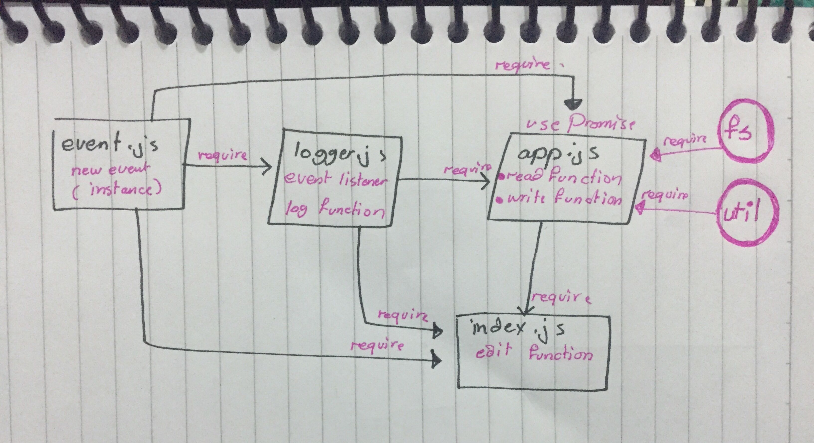

# lab-16 - Event Driven ApplicaTion 

## Auther : As-har Aloran

## Links and Resources
* (pull request) : [] 
* (ci/cd) : [https://github.com/asharoran-401-advanced-javascript/lab-16/actions] 

## How to initialize/run your application (where applicable)
- npm start
- nodemon

## Tests
- npm test
- npm run test
## UML

* whiteBoard : 